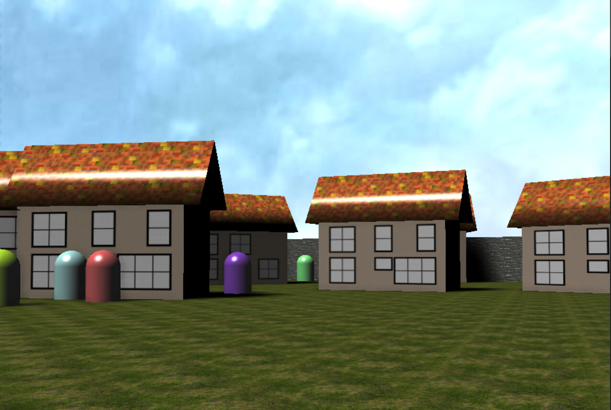

# babylon-fps-shooter



FPS shooter sample on Babylon.js with Vite.

- [babylon.js forum thread](https://forum.babylonjs.com/t/fps-shooter-sample-on-babylon-js-with-vite/21822)

## Prerequisites

- node.js v14 or v16
- yarn v1.x

## Debugging

```bash
$ yarn install --frozen-lockfile
$ yarn dev
```

open browser http://localhost:3000/

## Build

```bash
$ yarn build
```

## Publish

[@semantic-release](https://github.com/semantic-release/semantic-release) upgrades automatically.
